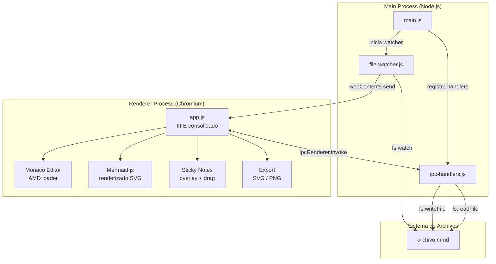
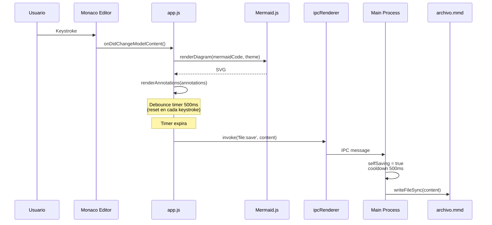
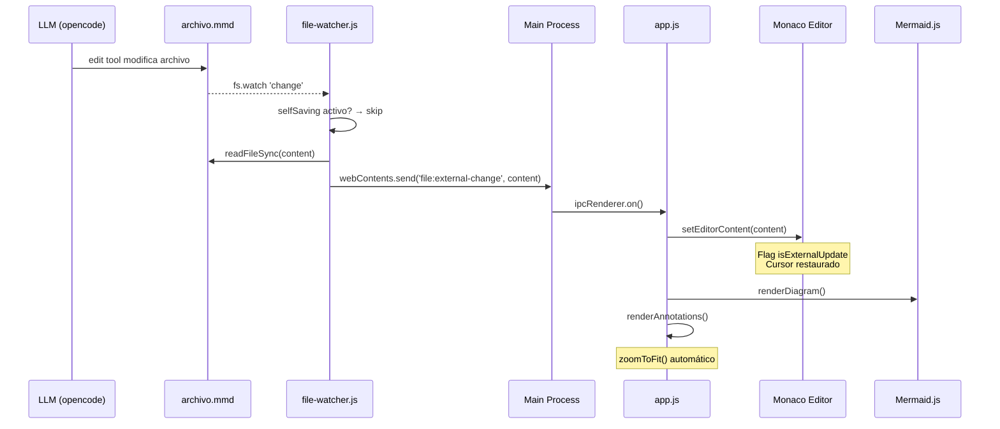
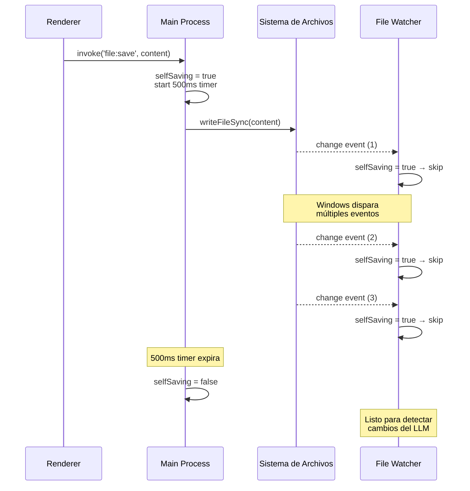
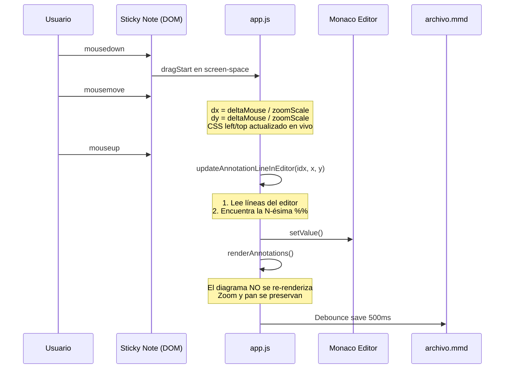
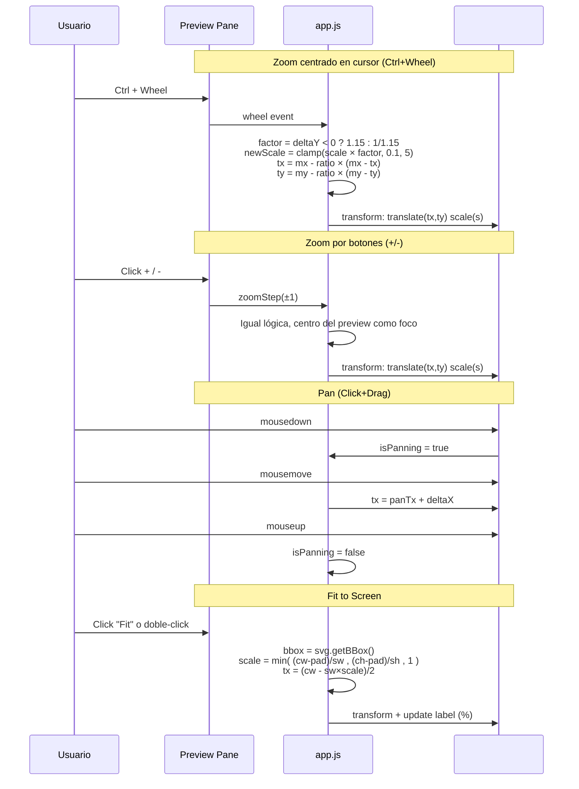

# Vizflow

## 1. Introducción

Aplicación de escritorio Electron para escribir y visualizar diagramas Mermaid en vivo. Monaco Editor a la izquierda, preview renderizado a la derecha. El archivo `.mmd` es la fuente única de verdad compartida entre el usuario y el LLM: ambos pueden editarlo y los cambios se reflejan instantáneamente en la UI.

### 1.1 Motivación

Las herramientas existentes (Mermaid Live en browser, extensiones de VSCode) no permiten que un LLM edite el mismo archivo y vea el resultado reflejado en una ventana nativa. Se requiere un bridge bidireccional donde el `.mmd` funcione como pizarra compartida.

### 1.2 Capacidades

| Feature | Cómo se usa |
|---|---|
| Editor Monaco | Panel izquierdo, syntax highlighting Mermaid, minimap, undo/redo |
| Render en vivo | Cada keystroke dispara `mermaid.render()` — feedback < 50ms |
| Guardado al archivo | Debounce de 500ms tras la última tecla |
| Sincronización con LLM | `fs.watch()` detecta ediciones externas → actualiza editor + preview |
| Sticky notes | Líneas `%%#` → notas flotantes sobre el diagrama |
| Drag & persistencia | Arrastrar nota → escribe `%%# @X,Y texto` en el archivo |
| Export SVG / PNG | Botones en toolbar, diálogo nativo de guardado |
| Tema dark / light | Toggle en toolbar, afecta Monaco + Mermaid + CSS |
| Zoom y pan | Ctrl+Wheel (zoom centrado en cursor), Click+Drag (pan), Fit to Screen |
| Zoom/Pan durante drag de notas | El zoom/pan se preserva al arrastrar notas (no se re-renderiza el diagrama) |
| CLI | `npm start archivo.mmd` — si no existe, se crea con template |
| Distribución cross-platform | `.exe` (Windows), `.dmg` (macOS), `.AppImage`/`.deb` (Linux) |

### 1.3 Stack

| Capa | Tecnología |
|---|---|
| Runtime | Electron 42 (Chromium + Node.js 22) |
| Editor | Monaco Editor 0.55 (AMD loader desde `node_modules`) |
| Diagramas | Mermaid.js 11 (renderizado en renderer process) |
| Parsing | js-yaml 5 (frontmatter), parser custom (`%%#`, `%%@`) |
| IPC | `ipcMain` / `ipcRenderer` nativos de Electron |
| File watching | `fs.watch()` nativo de Node.js |
| Build | electron-builder (NSIS, DMG, AppImage, deb) |

### 1.4 Formato de archivo `.mmd`

```mmd
---
title: System Architecture
theme: dark
---

graph TD
    A[Frontend] --> B[API Gateway]
    B --> C[Auth Service]
    B --> D[Data Service]
    C --> E[(DB)]

%%# @200,50 Entry point for all client requests
%%# @350,180 Handles JWT validation
%%# Architecture v2 — review before Q3
```

| Sintaxis | Significado |
|---|---|
| `---` delimiters | YAML frontmatter (`title`, `theme`) |
| `%%#` | Anotación general (sticky note flotante) |
| `%%# @X,Y` | Anotación con posición explícita (persiste al arrastrar con el mouse) |
| `%%@` | Anotación por nodo (placeholder v2) |

---

## 2. Desarrollo

### 2.1 Arquitectura general



El Main Process maneja I/O de archivos y file watching. El Renderer Process contiene Monaco Editor, Mermaid.js, el overlay de anotaciones y la lógica de export. La comunicación es vía IPC de Electron: `invoke` para request/response (renderer → main), `send` para notificaciones (main → renderer).

Todo el código del renderer está en `app.js` como un IIFE. Esto evita conflictos entre `require` de Node.js y el AMD loader de Monaco, que sobrescriben la misma variable global.

### 2.2 Flujo: usuario escribe → render + save



El renderizado es instantáneo en cada keystroke (stripping de líneas `%%` antes de pasar a Mermaid). El guardado al archivo usa debounce de 500ms para no saturar el sistema de archivos. Cada save activa el flag `selfSaving` para que el file watcher no interprete la escritura como un cambio externo.

### 2.3 Flujo: LLM edita el archivo → UI se actualiza



El LLM usa la herramienta `edit` de opencode sobre el archivo `.mmd`. `fs.watch()` en el main process detecta el cambio, y si `selfSaving` está inactivo (no fue un save propio), lee el nuevo contenido y lo envía al renderer vía `webContents.send`. El renderer actualiza Monaco preservando la posición del cursor y re-renderiza el diagrama con `zoomToFit()` para que el nuevo contenido sea visible.

### 2.4 Mecanismo anti-loop: selfSaving con cooldown



**Problema**: `fs.watch()` en Windows dispara múltiples eventos `change` por cada `writeFileSync()`. Si `selfSaving` se resetea en el primer evento, el segundo evento atraviesa el filtro y re-dispara `renderDiagram()` con `zoomToFit()`.

**Solución**: `selfSaving` usa un cooldown de 500ms. Al activarse (`setSelfSaving(true)`), inicia un timer. Todos los eventos de `fs.watch` dentro de esos 500ms son ignorados. Al expirar el timer, `selfSaving` vuelve a `false` automáticamente.

### 2.5 Flujo: arrastrar sticky note → persistencia en archivo



Al arrastrar una sticky note, la posición se convierte de screen-space a stage-space dividiendo por `zoomScale`. Al soltar, se modifica la línea `%%#` correspondiente en el editor: se eliminan todos los `@X,Y` previos (incluyendo coordenadas negativas acumuladas por bugs anteriores) y se escribe uno solo limpio.

Solo se re-renderizan las anotaciones — el diagrama Mermaid no se toca, preservando el estado de zoom y pan.

### 2.6 Zoom y Pan



El zoom y pan se aplican vía CSS `transform` sobre `#preview-stage`, un wrapper que contiene tanto el SVG de Mermaid como el overlay de sticky notes. Esto garantiza que ambos se muevan y escalen juntos.

- **Rango**: 10% – 500%
- **Doble-click en preview**: resetea a 100%
- **Nuevo diagrama renderizado**: auto `zoomToFit()`
- **Arrastrar nota**: no dispara `zoomToFit()`

### 2.7 Estructura del proyecto

```
Vizflow/
├── package.json              # Dependencias, scripts, electron-builder
├── README.md                 # Este documento
├── .gitignore
├── openspec/                 # Specs spec-driven
│   └── changes/mermaid-live-editor/
│       ├── proposal.md
│       ├── design.md
│       ├── tasks.md
│       └── specs/
│           ├── live-mermaid-editor/spec.md
│           ├── file-sync-bridge/spec.md
│           ├── diagram-annotations/spec.md
│           ├── diagram-export/spec.md
│           ├── diagram-zoom-pan/spec.md
│           ├── annotation-drag-persist/spec.md
│           └── app-cli/spec.md
└── src/
    ├── main/                 # Electron Main Process
    │   ├── main.js           # Entry point, CLI args, window 1400×900
    │   ├── ipc-handlers.js   # file:read, file:save, export:svg, export:png
    │   └── file-watcher.js   # fs.watch + filtro selfSaving
    ├── renderer/             # Electron Renderer Process
    │   ├── index.html        # Shell + Monaco AMD loader + CSS vars
    │   ├── styles.css        # Layout, toolbar, sticky notes, zoom controls
    │   └── app.js            # IIFE: editor, renderer, annotations, export, zoom
    └── shared/               # Main y Renderer comparten
        ├── parser.js         # parseMmd() — YAML frontmatter + %%# + %%@
        └── default.mmd       # Template para archivos nuevos
```

### 2.8 IPC Protocol

| Canal | Dirección | Payload | Propósito |
|---|---|---|---|
| `file:read` | Renderer → Main | — | Leer `.mmd` al iniciar |
| `file:save` | Renderer → Main | `content: string` | Guardar + activar selfSaving |
| `get:filepath` | Renderer → Main | — | Obtener ruta absoluta del archivo |
| `export:svg` | Renderer → Main | `{svgContent, defaultName}` | Diálogo nativo + write SVG |
| `export:png` | Renderer → Main | `{dataUrl, defaultName}` | Diálogo nativo + base64 → Buffer |
| `file:external-change` | Main → Renderer | `content: string` | Notificar cambio externo detectado por watcher |

### 2.9 Decisiones técnicas

**Electron sobre Tauri/pywebview.** Tauri y pywebview requieren dependencias del sistema operativo (WebView2 en Windows, webkit2gtk en Linux). Electron incluye Chromium + Node.js → comportamiento idéntico en cualquier OS sin instalar nada. Monaco Editor fue diseñado para Electron.

**`nodeIntegration: true` (MVP).** Simplifica el acceso a `require()` sin preload script. En v2 se migrará a `contextBridge + preload.js` por seguridad.

**Todo el renderer en `app.js` (IIFE).** Monaco Editor usa un AMD loader que sobrescribe `window.require`, creando conflicto con Node.js `require`. Solución: salvar `nodeRequire = require` antes de que Monaco cargue, consolidar todo el código del renderer en un solo archivo, usar `nodeRequire()` para módulos Node y `window.require()` para AMD.

**`selfSaving` con cooldown de 500ms.** `fs.watch()` en Windows dispara múltiples eventos `change` por escritura. El cooldown bloquea todos los eventos durante 500ms, evitando re-renders y `zoomToFit()` espurios.

**Zoom/Pan con CSS `transform`.** En lugar de manipular el SVG o usar librerías externas, se aplica `transform: translate(tx,ty) scale(s)` sobre `#preview-stage`. Esto mueve y escala tanto el diagrama como las sticky notes simultáneamente.

---

## 3. Desarrollo

### 3.1 Setup

**Requisitos:** Node.js >= 18, npm >= 9

```bash
git clone <repo-url>
cd Vizflow
npm install
```

### 3.2 Ejecutar en desarrollo

```bash
# Abrir archivo existente
npm start test-diagram.mmd

# Crear archivo nuevo (template automatico)
npm start nuevo_diagram.mmd

# O con npm link (comando vizflow global en modo dev):
npm link
vizflow test-diagram.mmd
```

---

## 4. Instalacion

### 4.1 Build

```bash
npm run dist
```

Genera en `dist/`:

| Plataforma | Archivo |
|------------|---------|
| Windows | `Vizflow Setup 1.0.0.exe` (NSIS installer) + `Vizflow 1.0.0.exe` (portable) |
| Linux | `vizflow_1.0.0_amd64.deb` + `Vizflow-1.0.0.AppImage` |
| macOS | `Vizflow-1.0.0.dmg` |

### 4.2 Windows

```powershell
# 1. Ejecutar el instalador
.\dist\Vizflow Setup 1.0.0.exe

# 2. Seguir: Next → Next → Install → Finish
#    El instalador agrega automaticamente Vizflow al PATH del usuario

# 3. Cerrar y reabrir PowerShell (o abrir una nueva pestaña)

# 4. Probar desde cualquier carpeta
vizflow mi-diagrama.mmd
```

**Desinstalar:** Desde `Configuracion > Aplicaciones > Vizflow`.  
La entrada en PATH queda (es inofensiva, apunta a un directorio que ya no existe).

### 4.3 Linux

**Vía .deb (recomendado):**
```bash
# Instalar
sudo dpkg -i dist/vizflow_1.0.0_amd64.deb

# Listo, desde cualquier carpeta
vizflow mi-diagrama.mmd
```

**Vía AppImage (portable):**
```bash
chmod +x dist/Vizflow-1.0.0.AppImage
sudo mv dist/Vizflow-1.0.0.AppImage /usr/local/bin/vizflow

vizflow mi-diagrama.mmd
```

**Desinstalar:**
```bash
# .deb
sudo dpkg -r vizflow

# AppImage
sudo rm /usr/local/bin/vizflow
```

### 4.4 macOS

```bash
# 1. Arrastrar Vizflow.app a /Applications/
open dist/Vizflow-1.0.0.dmg

# 2. Crear symlink para usar desde terminal
sudo ln -s /Applications/Vizflow.app/Contents/MacOS/Vizflow /usr/local/bin/vizflow

# 3. Probar
vizflow mi-diagrama.mmd
```

---

## 5. Controles

| Accion | Atajo / UI |
|---|---|
| Escribir Mermaid | Monaco Editor (izquierda) |
| Ver diagrama | Preview (derecha) |
| Guardar | Automatico (debounce 500ms) |
| Zoom in/out | Ctrl+Wheel o botones `+` `-` |
| Pan | Click + arrastrar en preview |
| Fit to Screen | Boton `Fit` o doble-click en preview |
| Mover sticky note | Click + arrastrar sobre la nota |
| Toggle theme | Boton en toolbar |
| Export SVG/PNG | Botones `SVG` `PNG` en toolbar |

---

## 6. Roadmap (v2)

- `%%@` anotaciones por nodo (tooltips ligados a elementos del diagrama)
- `contextBridge` + `preload.js` (aislar renderer del main process)
- TypeScript estricto
- Tests automatizados
- Soporte para `fs.watchFile()` (polling fallback en Linux)
