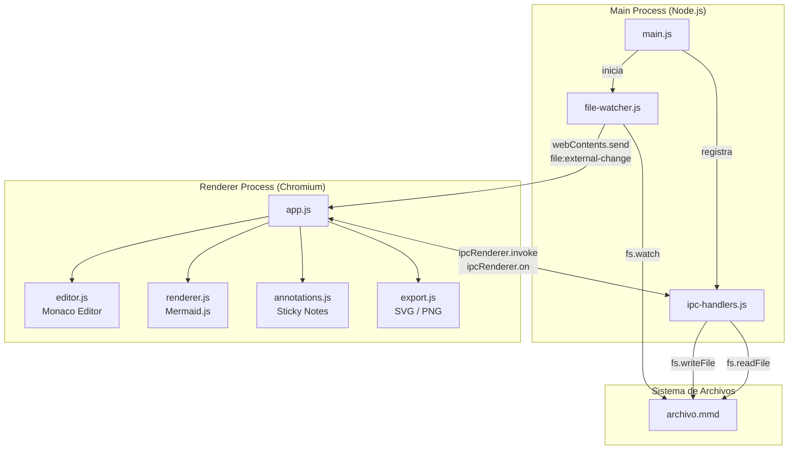
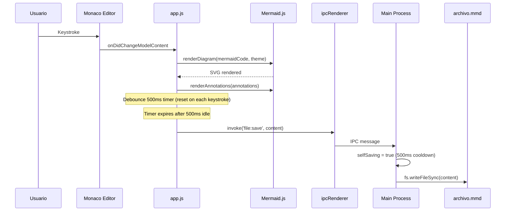
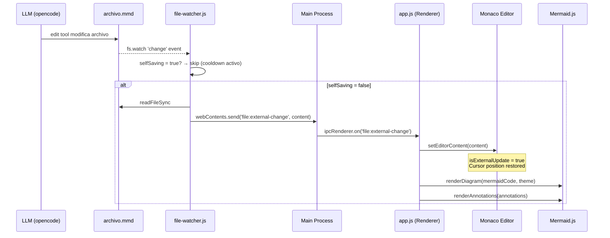
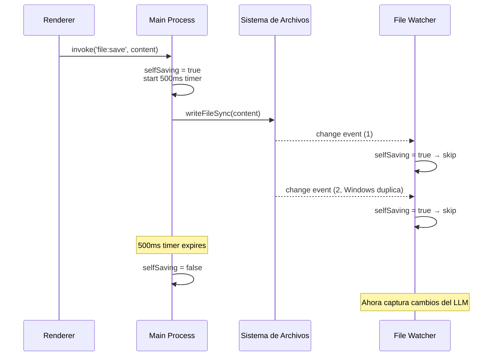
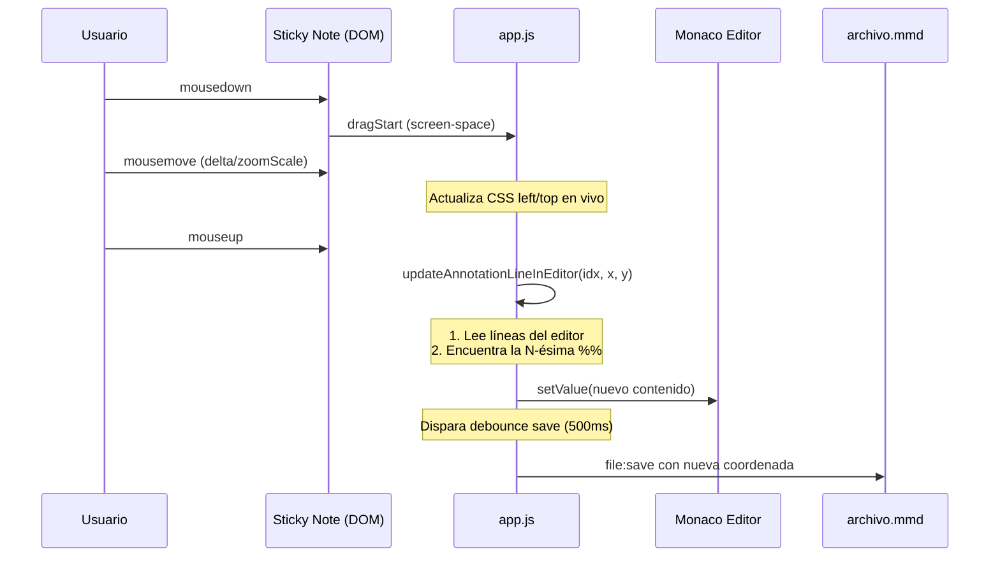
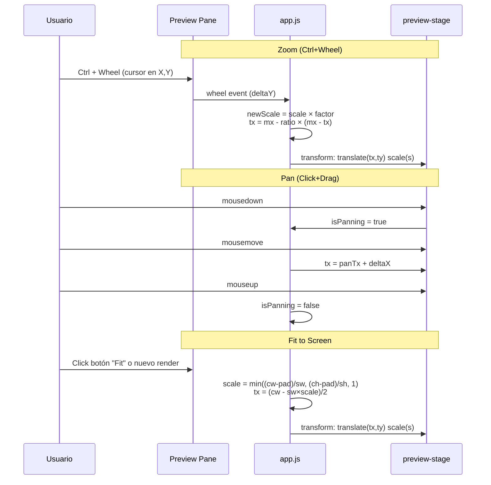
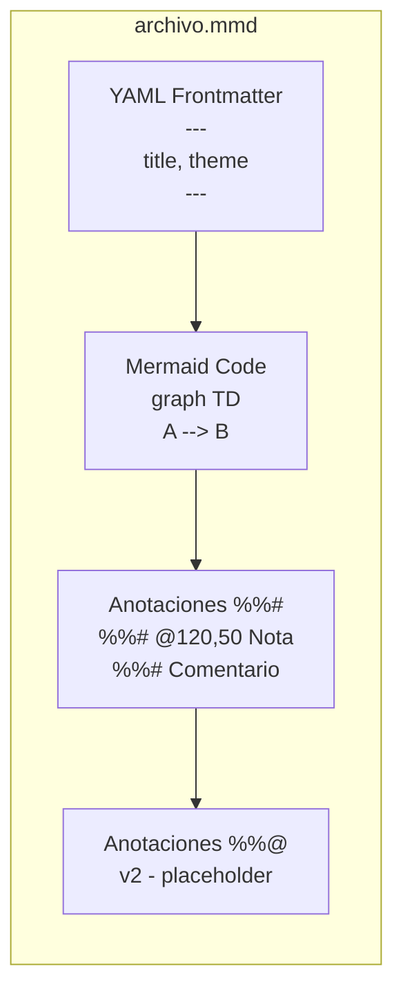

# Mermaid Live Editor

> Aplicación Electron desktop con Monaco Editor y renderizado Mermaid.js en vivo. El archivo `.mmd` es la fuente única de verdad compartida entre humano y LLM.

## Arquitectura



## Flujo de eventos

### Usuario escribe en Monaco → Render + Save



### LLM edita el archivo → UI se actualiza



### Mecanismo anti-loop: selfSaving cooldown



### Arrastrar sticky note → Persistencia en archivo



### Zoom y Pan



## Formato de archivo `.mmd`



### Ejemplo

```mmd
---
title: System Architecture
theme: dark
---

graph TD
    A[Frontend] --> B[API Gateway]
    B --> C[Auth Service]
    B --> D[Data Service]
    C --> E[(DB)]

%%# @200,50 Entry point for all client requests
%%# @350,180 Handles JWT validation and session management
%%# Architecture v2 - needs review before Q3
```

### Convenciones

| Sintaxis | Significado |
|---|---|
| `---` delimiters | Bloque YAML frontmatter (metadata: title, theme) |
| `%%#` | Anotación general (sticky note flotante) |
| `%%# @X,Y` | Anotación con posición explícita (persiste al arrastrar) |
| `%%@` | Anotación por nodo (placeholder v2) |

## Estructura del proyecto

```
Vizflow/
├── package.json              # Dependencias, scripts, electron-builder config
├── README.md                 # Esta documentación
├── .gitignore
├── test-diagram.mmd          # Archivo de prueba
├── openspec/                 # Specs del proyecto (spec-driven)
│   └── changes/mermaid-live-editor/
│       ├── proposal.md
│       ├── design.md
│       ├── tasks.md
│       └── specs/
│           ├── live-mermaid-editor/
│           ├── file-sync-bridge/
│           ├── diagram-annotations/
│           ├── diagram-export/
│           ├── diagram-zoom-pan/
│           ├── annotation-drag-persist/
│           └── app-cli/
└── src/
    ├── main/                 # Electron Main Process
    │   ├── main.js           # Entry point, CLI args, window creation
    │   ├── ipc-handlers.js   # IPC handlers (read/write/export)
    │   └── file-watcher.js   # fs.watch con filtro selfSaving
    ├── renderer/             # Electron Renderer Process (Chromium)
    │   ├── index.html        # HTML shell + Monaco AMD loader setup
    │   ├── styles.css        # Layout, temas, zoom controls
    │   └── app.js            # Toda la lógica del renderer (IIFE)
    └── shared/               # Código compartido
        ├── parser.js         # parseMmd() - YAML + %%# + %%@
        └── default.mmd       # Template por defecto

Nota: Los archivos editor.js, renderer.js, annotations.js, export.js del plan original
      fueron consolidados en app.js para evitar conflictos de módulos entre
      Node.js require y Monaco AMD loader en el renderer process.
```

## Componentes del Renderer (`app.js`)

| Módulo | Funciones clave | Responsabilidad |
|---|---|---|
| **init** | `init()`, `start()` | Inicialización: leer archivo, crear editor, primer render |
| **Editor** | `initEditor()`, `getEditorContent()`, `setEditorContent()`, `updateEditorTheme()` | Monaco Editor + Mermaid monarch tokens + debounce save |
| **Renderer** | `renderDiagram()`, `handleContentChange()` | Mermaid.js render + zoomToFit automático |
| **Annotations** | `renderAnnotations()`, `updateAnnotationLineInEditor()` | Sticky notes con drag + persistencia `@X,Y` |
| **Export** | `exportSvg()`, `exportPng()`, `getSvgWithAnnotations()` | SVG/PNG via IPC, 2x resolution para PNG |
| **Theme** | `setTheme()`, `checkThemeFromFm()` | CSS custom properties + Monaco + Mermaid themes |
| **Zoom/Pan** | `applyZoom()`, `zoomStep()`, `zoomToFit()`, `setupZoomPan()` | CSS transform + wheel/mouse handlers |

## IPC Protocol

| Canal | Dirección | Payload | Handler |
|---|---|---|---|
| `file:read` | Renderer → Main | — | Lee archivo, retorna string |
| `file:save` | Renderer → Main | `content: string` | Escribe archivo, activa `selfSaving` |
| `get:filepath` | Renderer → Main | — | Retorna ruta absoluta del `.mmd` |
| `export:svg` | Renderer → Main | `{svgContent, defaultName}` | Native save dialog, escribe SVG |
| `export:png` | Renderer → Main | `{dataUrl, defaultName}` | Native save dialog, convierte base64 → Buffer |
| `file:external-change` | Main → Renderer | `content: string` | Detectado por `fs.watch()`, actualiza editor |
| `dialog:usage` | Main → UI | — | Error dialog si no se especifica archivo |

## Setup y Uso

### Requisitos

- Node.js ≥ 18
- npm ≥ 9

### Instalación

```powershell
cd Vizflow
npm install
```

### Desarrollo

```powershell
# Abrir un archivo existente
npm start test-diagram.mmd

# Abrir archivo nuevo (se crea con template)
npm start nuevo_diagram.mmd
```

### Distribución

```powershell
npm run dist
```

Genera:
- Windows: `.exe` (NSIS installer + portable)
- macOS: `.dmg`
- Linux: `.AppImage` + `.deb`

### Features

| Feature | Acción | Implementación |
|---|---|---|
| Editor Monaco | Dividido 50/50 con preview | Monarch tokens para Mermaid |
| Render en vivo | Cada keystroke | `mermaid.render()` < 50ms |
| Guardado | 500ms debounce | `ipcRenderer.invoke('file:save')` |
| LLM sync | El LLM edita el `.mmd` | `fs.watch()` → `webContents.send()` |
| Anti-loop | Evita que save propio re-triggere watcher | `selfSaving` flag con cooldown 500ms |
| Sticky notes | `%%#` líneas → notas flotantes | CSS `position: absolute` sobre SVG |
| Drag notes | Arrastrar para reposicionar | Mouse events + zoom-aware coords |
| Persistencia notas | `%%# @X,Y texto` en archivo | `updateAnnotationLineInEditor()` |
| Export SVG | Botón en toolbar | `getSvgWithAnnotations()` → IPC |
| Export PNG | Botón en toolbar | Canvas 2x → data URL → IPC |
| Dark/Light | Botón en toolbar | CSS vars + Monaco + Mermaid themes |
| Zoom | Ctrl+Wheel / botones +/- | CSS `transform: scale()` en stage |
| Pan | Click+drag en preview | CSS `transform: translate()` en stage |
| Fit to Screen | Botón "Fit" / auto en render | `getBBox()` → scale calculation |
| CLI | `npm start archivo.mmd` | `process.argv` parsing en main.js |

## Decisiones técnicas

### Por qué Electron (+150MB)

Tauri y pywebview requieren dependencias del sistema (WebView2 en Windows, webkit2gtk en Linux). Electron incluye Chromium + Node.js → comportamiento idéntico en cualquier OS sin instalar nada extra. Monaco Editor fue diseñado para Electron (es el editor de VSCode).

### Por qué `nodeIntegration: true` (MVP)

Simplifica el acceso a `require('fs')`, `require('path')` y `ipcRenderer` sin necesidad de un preload script. En v2 se migrará a `contextBridge` + `preload.js` para mayor seguridad.

### Por qué todo en `app.js` (sin módulos separados)

Monaco Editor usa un AMD loader que sobrescribe `window.require`, creando un conflicto con Node.js `require`. La solución fue:
1. Salvar `nodeRequire = require` antes de que Monaco cargue
2. Consolidar todo el código del renderer en un solo archivo (IIFE)
3. Usar `nodeRequire()` para módulos Node, `window.require()` para AMD

Esto evita problemas de resolución de rutas entre scripts cargados vía `<script src>` vs `nodeRequire()`.

### Por qué `selfSaving` con cooldown de 500ms

En Windows, `fs.watch()` dispara múltiples eventos `change` por cada `writeFileSync`. Sin cooldown, el primer evento resetea `selfSaving = false` y el segundo evento traspasa el filtro → re-render innecesario + `zoomToFit()`. Con cooldown, todos los eventos dentro de 500ms son bloqueados.

### Por qué `zoomToFit()` automático

Cada vez que se renderiza un diagrama nuevo, se ajusta al viewport para que el usuario vea el resultado completo. Al arrastrar una sticky note, el diagrama NO se re-renderiza → el zoom/pan se preserva.
